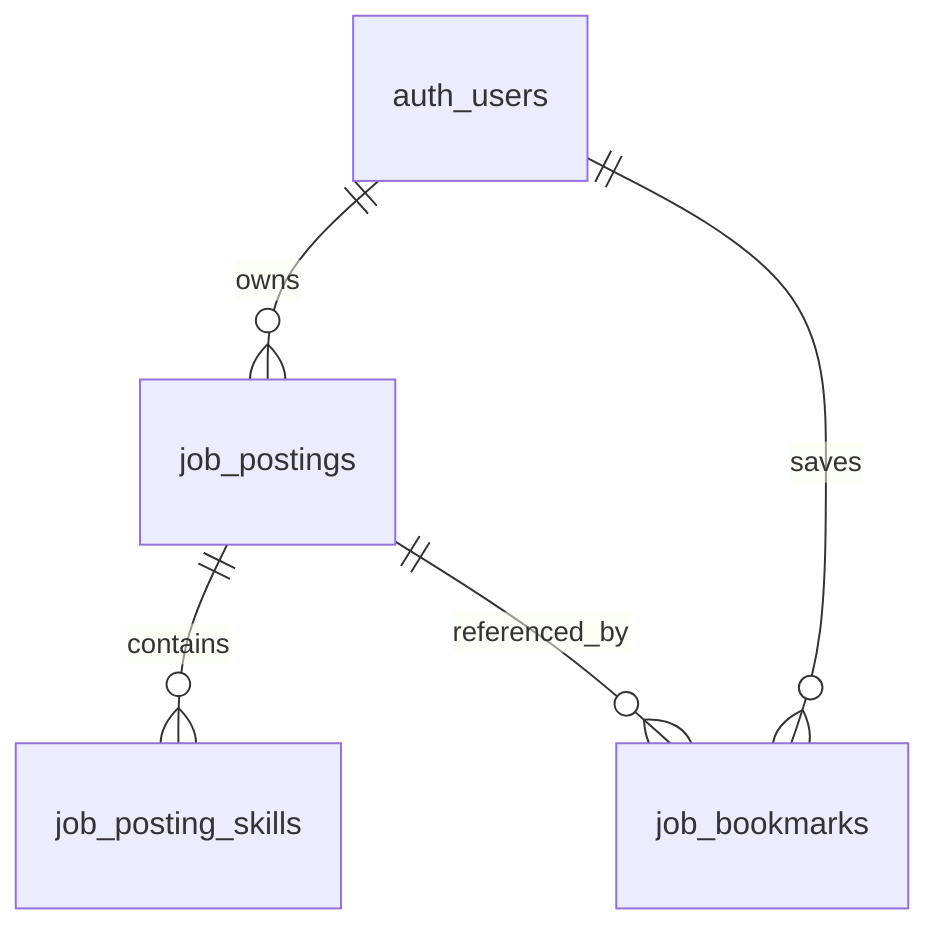

# 채용공고 MVP API 및 예시 자료

## 구현 범위

공개 예시 공고 검색·조건 필터·페이지 이동·상세 조회, 계정별 저장/해제, 내 공고 작성·수정·삭제를 제공합니다. 선택한 공고의 회사/직무/본문을 기존 `PUT /api/v1/job`에 전달하면 이력서→질문→모의지원 흐름으로 이어집니다. 이력서 저장이 먼저 필요합니다. 실제 기업에 지원서를 제출하거나 메일을 전송하지 않습니다.

## API

모든 경로는 `/api/v1` 기준입니다. 변경 요청에는 로그인 쿠키와 `X-CSRF-Token`이 필요합니다.

| 요청 | 동작 |
|---|---|
| GET /job-postings | 예시 및 로그인한 본인의 비공개 공고 목록 |
| GET /job-postings/{id} | 접근 가능한 공고 상세, `{posting}` |
| POST /job-postings | 내 비공개 공고 작성, 201 `{posting}` |
| PUT /job-postings/{id} | 내 공고 전체 수정, `{posting}` |
| DELETE /job-postings/{id} | 내 공고 삭제, `{deleted:true,id}` |
| POST /job-postings/{id}/bookmark | 내 저장 목록에 추가, `{posting}` |
| DELETE /job-postings/{id}/bookmark | 내 저장 목록에서 제거, `{posting}` |
| GET /job-matches | 현재 사용자의 저장된 이력서와 접근 가능한 전체 공고 비교, `{job_matches}` |

`/job-matches`는 로그인이 필요합니다. 같은 결과가 모의지원 보고서의 `report.job_matches`에도 포함됩니다. [매칭 API와 점수 기준](job-matching.md)을 참고하세요.

목록 검색: `q`(회사·직무·본문·기술의 부분 일치), `location`, `employment_type`, `experience_level`, `skill`, `saved=1`, `page`(기본 1), `page_size`(기본 12, 최대 50). `q`의 %와 _는 와일드카드가 아닌 글자로 처리합니다. 영문 검색/기술은 대소문자를 구분하지 않습니다. 다른 조건은 정확히 일치해야 합니다. `saved=1`은 로그인 필수입니다.

응답은 `{items,total,page,page_size,filters:{locations,employment_types,experience_levels,skills}}`입니다. 필터 선택지는 현재 조건과 무관하게 본인에게 보이는 전체 공고를 기준으로 만들어지며, 다른 사용자의 입력은 포함하지 않습니다. 없는 페이지는 200과 빈 목록을 반환합니다.

작성/수정 필드: company·role(1~120자), location·employment_type·experience_level(1~80자), description(40~50,000자), skills(최대 20개, 각 1~50자), source_url(선택, 최대 2,000자). 기술 중복은 대소문자를 무시하고 제거합니다. `id/owner_id/source_type/created_at`은 서버에서 결정합니다. source_url은 자격 증명이 없는 http(s) 링크만 허용하며 서버가 이 URL을 가져오지는 않습니다. HTML은 본문 문자열로 다루고 화면에서 이스케이프합니다.

공고의 `is_owner`는 현재 사용자 작성 여부, `is_saved`는 현재 사용자 저장 여부입니다. DB의 owner_id는 노출하지 않습니다. 타인 공고 접근·수정·삭제는 404, 인증 없음은 401, CSRF/Origin 오류는 403, 입력 오류는 400을 반환합니다. 중복 저장/해제는 멱등적입니다.

## 데이터와 출처

`data/examples/job_postings.json`은 **30개의 합성 공고**입니다. 공개 공식 채용공고의 직무·기술 주제를 소규모로 확인한 뒤 독립적인 교육 예시 문장으로 새로 작성했습니다. 회사 이름, 위치, 경력, 고용 형태, 날짜는 전부 가상 조건입니다. 원문 전체·지원자 정보·연락처를 복제하지 않았습니다. `source_url`은 예시 회사의 실제 공고가 아니라 해당 주제를 참고한 공식 페이지입니다. 프론트엔드는 이 링크를 “참고한 실제 직무 공고”로 구분해야 합니다.

`data/examples/orchestration_job_postings.json`의 AI 오케스트레이션 관련 공고 30개와 `expanded_job_postings.json`의 다양한 직무 공고 540개를 함께 읽어 기본 카탈로그는 총 600개입니다. 기존 60개도 회사·팀 맥락, 구체적인 업무와 조건을 보강했습니다. 공고당 본문은 1,308~1,476자이며 급여와 조건은 명시적으로 가상입니다. 예시 공고는 시작할 때 추가·갱신하며 기존 ID, 사용자 작성 공고와 북마크를 보존합니다. [600개 공고의 작성 방식과 분포](../references/expanded-job-catalog.md)를 참고하세요.

참고일: 2026-10-02 (Asia/Seoul). 아래 날짜는 현재 모집 상태를 보증하지 않습니다. 공개 공식 채용 상세/채용 행사 페이지의 직무 주제를 참고했습니다. 조회만 했으며 사이트에 메시지·지원·댓글을 남기지 않았습니다. 런타임 수집이나 주기적 스크래핑은 없습니다.

| 주제 | 해당 예시 ID | 참고 자료 |
|---|---|---|
| server | `example-backend-python`, `example-backend-kotlin`, `example-backend-platform` | [공식 참고 페이지](https://toss.im/career/job-detail?company=%ED%86%A0%EC%8A%A4&job_id=4071141003&sub_position_id=4071145003) |
| frontend | `example-frontend-web`, `example-frontend-react`, `example-frontend-design-system` | [공식 참고 페이지](https://toss.im/career/job-detail?job_id=4076130003) |
| data | `example-data-pipeline`, `example-search-platform`, `example-vector-platform` | [공식 참고 페이지](https://toss.im/career/job-detail?job_id=8006356003) |
| ai | `example-ai-engineer`, `example-agent-evaluation`, `example-agent-orchestration` | [공식 참고 페이지](https://toss.im/career/job-detail?job_id=7825510003) |
| devops | `example-cloud-engineer`, `example-devops-platform`, `example-site-reliability` | [공식 참고 페이지](https://toss.im/career/job-detail?job_id=4071151003) |
| design | `example-product-designer`, `example-ux-prototype`, `example-design-research` | [공식 참고 페이지](https://toss.im/career/designer-challenge-2026) |
| qa | `example-qa-automation`, `example-qa-product`, `example-qa-mobile` | [공식 참고 페이지](https://toss.im/career/job-detail?job_id=4071136003) |
| android | `example-android-app`, `example-android-sdk`, `example-android-platform` | [공식 참고 페이지](https://toss.im/career/job-detail?job_id=5153070003) |
| solution | `example-ai-integration`, `example-voice-ai` | [공식 참고 페이지](https://toss.im/career/job-detail?job_id=8000575003) |
| po | `example-ai-product-owner`, `example-recommendation-po` | [공식 참고 페이지](https://toss.im/career/job-detail?job_id=6532656003) |
| analytics | `example-data-analyst` | [공식 참고 페이지](https://toss.im/career/job-detail?job_id=7834735003) |
| quality | `example-data-quality` | [공식 참고 페이지](https://toss.im/career/job-detail?job_id=7995370003) |

## 데이터 공급자 확장

`app/integrations/job_sources/catalog.py`의 `JobSource` 프로토콜과 `LocalExampleSource`가 자료를 읽고, `app/application/jobs.py`가 검증하여 저장합니다. 현재 실행 공급자는 로컬 JSON이며 API 키와 네트워크가 필요하지 않습니다. 사용자가 입력한 source_url을 수집 주소로 사용하지 않습니다.

실제 제공자 API를 붙일 때는 이 폴더에 제공자 전용 어댑터를 추가하고, 서버의 환경변수로 키를 읽고, 고정된 제공자 호스트·응답 매핑·타임아웃·재시도·중복 ID 규칙을 정의합니다. 실제 수집 자료를 example로 표시하면 안 되므로 live source_type과 출처 시각 필드를 계약/DB 마이그레이션에 함께 추가해야 합니다. 현재 구조에 이 경계는 준비되어 있으나 실제 API 어댑터는 아직 구현하지 않았습니다.

## 저장 구조

기존 팀원의 `DATABASE_URL` 설정을 그대로 사용합니다. SQLite와 PostgreSQL 공통 DB 경계를 사용하며 Supabase 전용 의존성은 없습니다. PostgreSQL 서버에서의 실연동 검증은 별도 환경이 필요합니다.

| 테이블·컬럼 | DB 타입 / 키 / 기본값 | 의미·제약 |
|---|---|---|
| job_postings.id | TEXT PK | 서버 생성 공고 ID |
| job_postings.owner_id | TEXT nullable FK auth_users.id | 예시만 NULL, 계정 삭제 시 CASCADE |
| job_postings.company, role | TEXT NOT NULL | 회사·직무, API 각 120자 제한 |
| job_postings.location, employment_type, experience_level | TEXT NOT NULL | 검색 조건, API 각 80자 제한 |
| job_postings.description | TEXT NOT NULL | 공고 본문, API 40~50,000자 |
| job_postings.source_type | TEXT NOT NULL CHECK | example 또는 manual, owner NULL 여부와 조합 검증 |
| job_postings.source_url | TEXT NOT NULL DEFAULT '' | 원문 또는 참고 링크 |
| job_postings.created_at | TEXT NOT NULL | UTC ISO 8601 시각, 예시는 합성 날짜 |
| job_posting_skills.posting_id | TEXT FK job_postings.id | 삭제 시 CASCADE |
| job_posting_skills.position | INTEGER | posting_id와 복합 PK, 기술 표시 순서 |
| job_posting_skills.skill | TEXT NOT NULL | posting_id+skill UNIQUE |
| job_bookmarks.user_id | TEXT FK auth_users.id | 삭제 시 CASCADE |
| job_bookmarks.posting_id | TEXT FK job_postings.id | user_id와 복합 PK, 삭제 시 CASCADE |

인덱스: `job_postings_owner(owner_id)`, 각 PK/UNIQUE 인덱스. 사용자 정보는 auth_users에서 참조하며 공고·기술·사용자별 저장 관계를 분리해 반복 목록을 행으로 저장합니다. 텍스트 최대 길이는 SQLite/PostgreSQL 공통 검증을 위해 애플리케이션에서 제한합니다. 기존 workspace JSON 저장 구조까지 3NF로 재설계한 것은 아닙니다.

## 검증

`python -m unittest tests.integration.test_job_postings tests.unit.test_expanded_job_catalog -v`는 공고 600건·전체 페이지·실질적인 직무별 변형·본문과 요구사항 경계·검색·개인 CRUD·타인 데이터 차단·북마크 유지·인증/CSRF·기존 모의지원 연결을 검증합니다. 테스트는 임시 SQLite DB를 사용하며 개인 런타임 데이터를 읽거나 변경하지 않습니다.
