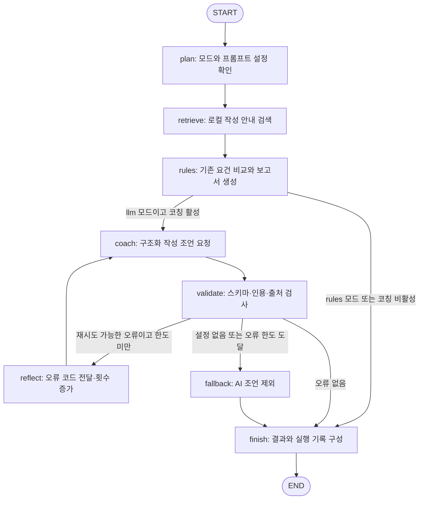
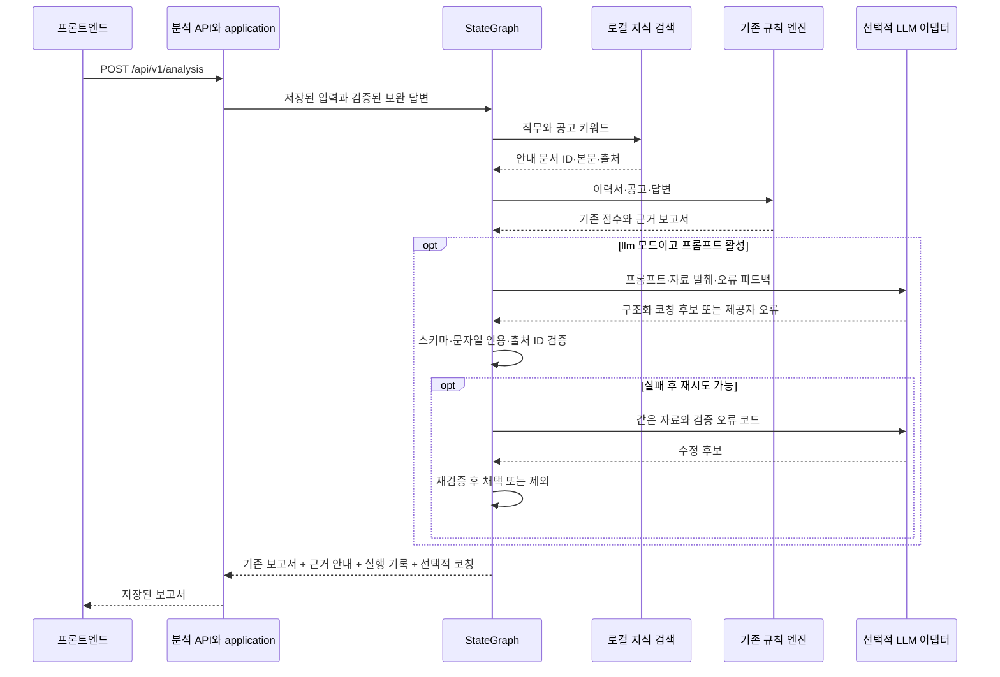
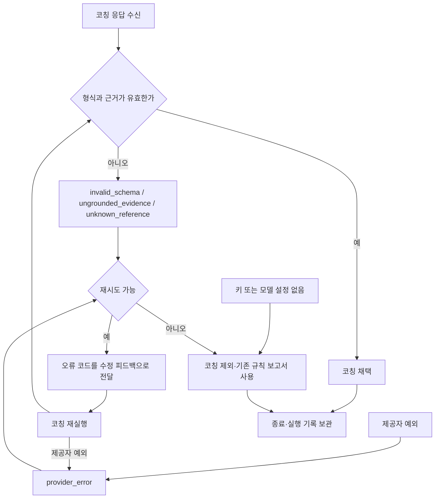

# 기존 분석을 유지하는 에이전트 확장

기준일: 2026-10-02. 기존 API·화면·폴더 역할을 유지하고, `app/application/workspace.py`가 `analyze_with_agent`를 호출하도록 분석 실행을 확장했습니다. 기존 점수·요건별 근거·질문·모의 회신은 `app/modules/analysis/reporting/service.py`의 규칙 결과를 사용합니다. 선택적 LLM은 별도의 작성 조언만 추가합니다.

설계 방향은 [교육 가이드의 LLM 앱 개발 과정](https://github.com/yleessam/2026-aio2-guide/tree/main/6_llm-app-dev)의 프롬프트 분리, 구조화 출력, 도구 경계, 재시도 및 StateGraph 개념을 참고했습니다. 예제 코드나 강의 본문을 복사한 구현은 아닙니다. 기준별 미완료 항목은 [프로젝트 2 적용 검토](../evaluations/project-2-coverage.md)에 기록합니다.

## 코드 책임과 변경 위치

| 위치 | 책임 | 수정 시 확인할 점 |
| --- | --- | --- |
| `app/application/workspace.py` | 인증된 사용자의 입력·저장 및 그래프 호출 | 기존 HTTP 응답 구조와 사용자 격리 |
| `app/agent/graphs/analysis.py` | StateGraph 연결·선택·검증·재시도·fallback | 종료 조건, 최대 호출 수, 기존 결과 보존 |
| `app/agent/state/analysis.py` | 요청 단위 TypedDict 상태 | 추가 필드의 소비자와 갱신 경로 |
| `app/modules/analysis/schemas.py` | 제공자에 독립적인 Pydantic 코칭 출력 | 그래프·어댑터가 공통 계약을 사용 |
| `app/agent/prompts/registry.json` | 프롬프트 등록·선택·버전·검색·재시도 설정 | 기본 ID가 유효한 등록 항목인지 확인 |
| `app/agent/prompts/coaching.md` | 한국어 작성 코칭 지침 | 원문 근거·지원자 사실·점수 변경 금지 유지 |
| `app/agent/prompts/loader.py` | 매 실행 시 등록 파일 검증·읽기 | 지정 디렉터리 밖 파일을 허용하지 않음 |
| `app/integrations/llm/coaching.py` | LangChain 템플릿·제공자·출력 스키마 | `.env`, 타임아웃, 외부 전송 범위 |
| `app/retrieval/search/local.py` | 지식 문서의 키워드 검색 | 의미 검색/벡터 검색과 구분 |
| `data/knowledge/policies/career-guidance.json` | 독립 작성한 직무별 작성 안내 | 지원자 경험으로 오인하지 않도록 출처 유지 |
| `app/modules/analysis` | 기존 결정적 점수·근거 비교 | LLM에 점수 계산을 넘기지 않음 |
| `scripts/evaluate-agent.py` | 합성 실패 응답의 전후 비교 | 실제 LLM 측정과 구분 |

## 실행 그래프

`plan`은 요청을 위한 설정 인지, 조건 함수는 실행 방식 판단, 검색·규칙 분석·코칭 노드는 행동, `validate`는 출력 검증 역할을 맡습니다. 이 흐름은 고정된 도구를 정책에 따라 호출합니다. LLM이 여러 도구 스키마를 보고 자율적으로 선택하는 Function Calling 에이전트는 아직 아닙니다.

## 분기·오류 정책

| 조건 | 처리 | 종료 조건 |
| --- | --- | --- |
| 기본 `CAREERLENS_ANALYSIS_MODE=rules` | 검색과 기존 규칙 보고서만 실행 | `finish` |
| 모드가 `rules`/`llm` 이외 | `invalid_mode` 기록 후 규칙 결과 사용 | `finish` |
| 등록·선택·파일 검증 실패 | `prompt_invalid`, 코칭 비활성 | 기존 분석은 계속 |
| 로컬 지식 읽기/형식 실패 | `retrieval_unavailable`, 빈 근거 목록 | 규칙 분석은 계속 |
| `llm`이며 선택 프롬프트 활성 | 구조화 코칭 요청 | 검증 성공 시 완료 |
| 키·모델 미설정 | `llm_unconfigured`, 외부 호출하지 않음 | 재시도 없이 fallback |
| 제공자 호출 실패 | `provider_error`만 기록, 상세 예외 비공개 | 최대 재시도 후 fallback |
| 출력 스키마 불일치 | `invalid_schema` | 오류 코드를 다음 요청에 전달 |
| 인용 구절이 제공된 이력서/답변 발췌에 없음 | `ungrounded_evidence` | 오류 코드를 다음 요청에 전달 |
| 인용한 안내 ID가 검색 결과에 없음 | `unknown_reference` | 오류 코드를 다음 요청에 전달 |
| 검증 실패가 재시도 후에도 지속 | `ai_coaching` 제외, 기존 보고서 반환 | `finish` |

기본 `max_retries=1`이며 설정 허용 범위는 0~1입니다. 첫 시도를 포함해 최대 2회 코칭 호출을 수행합니다. 제공자 내부 재시도는 0, 개별 호출 타임아웃은 15초, 그래프 재귀 제한은 16으로 설정했습니다. 이 수치는 실제 응답 시간 측정이나 전체 요청의 엄격한 시간 상한을 뜻하지 않습니다.

기존 입력 검증 실패나 규칙 엔진 예외는 HTTP 오류로 처리합니다. 모든 오류를 성공 보고서로 바꾸는 광범위 fallback은 아닙니다. `reflect`는 오류 코드와 재시도 횟수를 전달하는 제한된 수정 루프이며, LLM이 스스로 근본 원인을 분석하고 여러 수정 도구를 선택하는 기능은 미구현입니다.

## 도구 호출 순서

도구 이름은 `local_guidance_search`, `rule_analysis`, `structured_coaching`, `evidence_validation`으로 기록합니다. `tools_called`는 코드에서 수행한 단계 기록이며 모델이 생성한 `tool_calls`는 아닙니다. 검색 비활성 시 `retrieve` 노드 진입만 기록하고 `local_guidance_search` 호출 기록은 추가하지 않습니다.

## 상태·기억·컨텍스트

`AnalysisState`는 `TypedDict(total=False)`입니다. 단계별로 필요한 필드만 채우므로 모든 필드가 항상 존재한다는 런타임 보증은 없습니다.

| 필드 묶음 | 타입 | 수명과 의미 |
| --- | --- | --- |
| `resume_text`, `company`, `role`, `job_text` | `str` | 현재 분석 입력 |
| `answers` | `dict[str, str]` | 별도 출처인 보완 답변 |
| `report`, `references` | `dict`, `list[dict]` | 규칙 보고서와 검색 안내 |
| `candidate`, `coaching` | `dict \| None` | 검증 전 후보와 통과한 코칭 |
| `steps`, `tools_called`, `error_codes` | `list[str]` | 관측 가능한 실행 단계와 오류 |
| `current_error`, `retry_count` | `str`, `int` | 현재 검증 피드백과 재시도 횟수 |
| `fallback_used` | `bool` | 대체 경로 사용 여부 |
| `prompt_version`, `prompt_text`, `settings`, `mode` | 문자열 또는 설정 객체 | 실행에 사용한 설정 |

상태는 요청 단위입니다. 사용자별 워크스페이스 저장은 기존 DB 기능이며 LangGraph의 영속 checkpointer나 장기 기억 저장소가 아닙니다. 대화 messages 누적, thread별 복원, 요약 기억, 사용자 선호 검색은 미구현입니다.

`max_context_chars` 기본값은 14,000이고 허용 범위는 4,000~20,000입니다. 먼저 이력서에 약 1/3, 공고에 1/4, 최대 3개 답변에 각각 1/12만큼 문자 발췌를 적용합니다. 검색 안내는 항목당 1,000자까지 포함하고, 직렬화한 JSON이 예산을 넘으면 안내부터 줄인 뒤 가장 긴 발췌를 줄여 한도를 맞춥니다. 인용·참고 ID는 최종 전달된 자료를 기준으로 검증합니다. 이는 토큰 계수, 의미 요약 또는 system 지침까지 포함한 전체 프롬프트의 길이 보증은 아닙니다. 안내 문서는 짧은 자체 작성 항목을 그대로 검색하므로 장문 문서 splitter도 아직 없습니다.

## 프롬프트·검색을 나중에 바꾸는 방법

1. 문구만 바꾸려면 `coaching.md`를 수정합니다. 매 분석마다 다시 읽으므로 다음 분석부터 반영됩니다.
2. 변형을 추가하려면 같은 폴더에 새 Markdown 파일을 만들고 `registry.json`의 `prompts`에 새 ID, 파일명, `enabled`, `version`을 등록합니다. `default`를 새 ID로 바꾸면 기본 선택이 바뀝니다.
3. 개인 환경에서만 다른 ID를 고르려면 `.env`의 `CAREERLENS_COACH_PROMPT`를 지정하고 서버를 재시작합니다.
4. 비활성화는 해당 항목의 `enabled=false`로 합니다. 삭제할 때에는 `default` 및 개인 선택 ID가 삭제된 항목을 가리키지 않도록 함께 정리합니다. 잘못된 설정은 규칙 결과로 대체됩니다.
5. 검색 안내는 `career-guidance.json`에서 고유 ID·제목·키워드·본문·출처를 추가·수정합니다. 문서 모델·ID 중복·파일/항목 크기를 검사합니다. `retrieval.enabled`와 `top_k`(1~5)는 등록 설정에서 바꿉니다.
6. 수정 후 단위 시험과 `scripts/evaluate-agent.py`를 실행하고 프롬프트·워크플로우 버전을 결과와 함께 기록합니다.

새로운 노드, 도구 또는 출력 필드는 프롬프트 파일만으로 추가되지 않습니다. 상태/스키마, 그래프 연결, 소비하는 UI와 계약을 함께 수정해야 합니다. 현재 프롬프트 편집 웹 화면이나 자동 A/B 배포·롤백은 없습니다.

LLM을 쓰려면 각자의 백엔드 `.env`에 `CAREERLENS_ANALYSIS_MODE=llm`, `OPENAI_API_KEY`, `CAREERLENS_LLM_MODEL`을 설정합니다. 기본값은 외부 호출 없는 규칙 모드입니다. API 키는 프론트엔드에 보내지 않습니다. LangSmith 추적은 분석과 모델 호출에서 끄며, 실행 기록에는 프롬프트 원문이나 제공자 예외 전문을 넣지 않습니다. 실제 이력서·답변·결과는 기존 개인 DB에 저장됩니다.

## 검증과 한계

`app/modules/analysis/schemas.py`의 `Coaching` 모델은 추가 필드를 금지하고 조언 개수·문장 길이를 제한합니다. 그래프와 LLM 어댑터가 이 공통 계약을 사용하여 어댑터가 agent 계층을 역참조하지 않습니다. 각 인용은 제공한 이력서/답변 발췌에 실제로 존재해야 하고, 참고 ID도 실제 전달한 검색 결과 안에 있어야 합니다. 따라서 안내문 자체를 지원자의 경력 증거로 사용할 수 없습니다.

이 검사는 인용 구절의 존재 여부를 확인합니다. 요약이나 조언이 인용 의미를 바꾸지 않았는지, 실제 경력이 사실인지, 제안이 항상 적절한지를 완전히 판정하지는 못합니다. 프롬프트 인젝션 방어 문구도 보안 완결성을 입증하지 않습니다. 실제 모델 호출·공격 사례·비용·지연·사용자별 기억은 추가 검증 대상입니다.

`tests/unit/test_agent_workflow.py`는 점수/기존 필드 보존, 잘못된 인용, 출처 ID, 추가 점수 필드, 제공자 실패, 프롬프트 재읽기/비활성/경로 제한, 검색 실패를 외부 호출 없이 검증합니다. `scripts/evaluate-agent.py`는 동일한 합성 입력에 정상·수정 가능한 인용·잘못된 스키마·잘못된 출처·타임아웃 응답을 주입합니다. 결과는 `evaluations/results/agent-baseline-v1.json`에 저장하며, 실제 LLM 평가와 구분한 정의 및 사례별 기록을 포함합니다.
