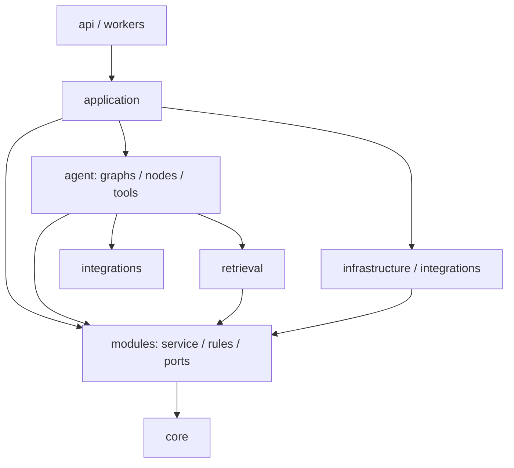

# 의존 방향과 구현 순서

## 의존 방향

아래 화살표는 import 또는 호출을 허용하는 방향입니다.

`app/application`은 유스케이스 실행과 외부 구현 조립을 담당합니다.
`app/modules`는 업무 모델·서비스·순수 계산·판정 규칙과 저장소/외부 기능 인터페이스를 담당합니다.
`app/agent`는 LLM 판단·그래프 분기·재시도와 모듈 규칙 호출을 담당합니다.

금지하는 참조는 `modules → agent/application/api/infrastructure/integrations`, `agent → application/api`입니다.
저장소·모델 제공자 구현은 application에서 주입합니다. 하위 규칙이 상위 실행 함수를 다시 import하지 않습니다.
`core`에는 여러 계층이 사용하는 설정·예외·로깅·보안 공통 기능을 두고, 업무 기능을 옮겨 넣지 않습니다.

## 초기 구현과 확장 영역

| 구분 | 영역 |
| --- | --- |
| 먼저 구현 | 이력서 입력·추출 확인·승인, 공고 선택, 분석 실행, 요건별 근거와 보완 질문 |
| 기본 웹 기능 | 인증·역할, 최근 분석·저장 공고 등 필요한 대시보드 |
| 필요에 따라 연결 | 문서 파서, LLM, 검색, 임베딩, DB·파일 저장 |
| 확장 예약 | 관리자 운영, 준비 일정·재계획, 기업 정보, 외부 일정 연동, 비동기 worker, 종합점수 |

예약 폴더는 기능을 채택할 때 구현합니다. 초기 흐름을 만들기 위해 모든 빈 폴더를 채울 필요는 없습니다.
새 하위 폴더는 기능을 추가하거나 파일의 책임이 분명히 나뉠 때 생성합니다.

`tests/fixtures`는 자동화 테스트·평가 입력이고 `data/knowledge`는 서비스에서 쓰는 기술·판정 지식입니다.
운영용 가상 공고 seed가 필요해지면 별도 적재 데이터 또는 DB로 관리하고, 실행 코드가 테스트 fixture 경로를 필수로 요구하게 만들지 않습니다.
현재 샘플·서비스 코드는 없으므로 실제 import 위반이나 운영 실행 결과를 검증한 상태는 아닙니다.
